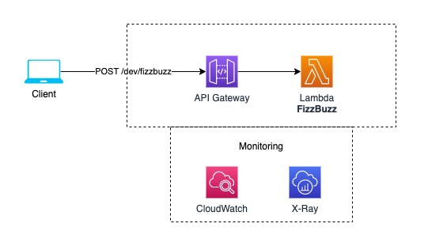

# Serverless FizzBuzz API

This project is a FizzBuzz game implementation using serverless pattern.

## Installation/deployment instructions

Depending on your preferred package manager, follow the instructions below to deploy your project.

### Using NPM

- Run `npm i` to install the project dependencies
- Run `npx sls deploy` to deploy this stack to AWS

### Using Yarn

- Run `yarn` to install the project dependencies
- Run `yarn sls deploy` to deploy this stack to AWS

## Test your service

This project contains a single lambda function triggered by an HTTP request made on the provisioned API Gateway REST API `/fizzbuzz` route with `POST` method. The request body must be provided as `application/json`.

- requesting `/fizzbuzz` without a valid `X-Api-Key` header will result in API Gateway returning a `403` HTTP error code.
- sending a `POST` request to `/fizzbuzz` with a payload **not** containing a number property named `number` and greater than 0 will result in API Gateway returning a `400` HTTP error code.
- sending a `POST` request to `/fizzbuzz` with a payload containing a number property named `number` will result in API Gateway returning a `200` HTTP status code with a `result` being either "fizzbuzz", "fizz", "buzz" or the `number` from request.

> :warning: The deployed service requires an API Key to execute the lambda through API Gateway.

### Locally

In order to test the fizzbuzz function locally, run the following command:

- `npx sls invoke local -f hello --path src/functions/hello/mock.json` if you're using NPM
- `yarn sls invoke local -f hello --path src/functions/hello/mock.json` if you're using Yarn

Check the [sls invoke local command documentation](https://www.serverless.com/framework/docs/providers/aws/cli-reference/invoke-local/) for more information.

Or using `serverless-offline` plugin to serve it locally (Test your requests against http://localhost:3000):

- `npm start` if you're using NPM
- `yarn start` if you're using Yarn

### Remotely

Copy and replace your `url` - found in Serverless `deploy` command output - and `name` parameter in the following `curl` command in your terminal or in Postman to test your newly deployed application.

```
curl --location --request POST 'https://xxxxxxxxxx.execute-api.us-east-1.amazonaws.com/dev/fizzbuzz' \
--header 'Content-Type: application/json' \
--header 'X-Api-Key: {SERVICE_API_KEY}'
--data-raw '{
    "number": 22
}'
```

## Project features

### Cloud deployment structure

The project was developed using many AWS core services, like:

- `Lambda` - Functions to handle business logic
- `API Gateway` - Service to handle HTTP connections and trigger lambda functions
- `Cloudwatch` - Monitoring service for API Gateway and lambda usage (logs)
- `X-Ray` - For debugging, it tracks requests end-to-end and represent it in a visual and dynamic way

And it's organized in the following way:



### Project structure

The project code base is mainly located within the `src` folder. This folder is divided in:

- `functions` - containing code base and configuration for your lambda functions
- `libs` - containing shared code base between your lambdas

```
.
├── src
│   ├── functions               # Lambda configuration and source code folder
│   │   ├── fizzbuzz
│   │   │   ├── factory         # `FizzBuzz` factory functions to create resources
│   │   │   ├── mock            # `FizzBuzz` lambda input parameters, if any, for local invocation
│   │   │   ├── app.ts          # `FizzBuzz` express app and middlewares definition
│   │   │   ├── handler.ts      # `FizzBuzz` lambda http server adapter creation
│   │   │   ├── helpers.ts      # `FizzBuzz` common functions to help handle requests
│   │   │   ├── routes.ts       # `FizzBuzz` express routes definition and handlers mapping
│   │   │   ├── service.ts      # `FizzBuzz` service layer definition for business logic
│   │   │   └── validation.ts   # `FizzBuzz` lambda input event JSON-Schema for validation
│   │   │
│   │   └── index.ts            # Import/export of all lambda configurations
│   │
│   └── libs                    # lambda shared code
│       ├── adapters            # external libraries adapter for common usage
│       ├── helpers             # common helper functions
│       ├── middlewares         # common middlewares
│       └── protocols           # interfaces definitions for lambda functions 
│
├── package.json
├── serverless.ts               # Serverless service file
├── tsconfig.json               # Typescript compiler configuration
└── tsconfig.paths.json         # Typescript paths
```

### 3rd party libraries

- [express](https://github.com/expressjs/express) - used to handle http requests from AWS API Gateway
- [serverless-http](https://github.com/dougmoscrop/serverless-http) - used to adapt serverless framework with an http server application
- [celebrate](https://github.com/arb/celebrate) - express middleware function to validate incoming requests
- [@serverless/typescript](https://github.com/serverless/typescript) - provides up-to-date TypeScript definitions for your `serverless.ts` service file
